# New Developer Guide

This guide is the starting point for understanding the entire Rate Limiter Lab system. It explains the project structure, runtime flow, rate limiting algorithm, Redis design, fault tolerance behavior, tests, and the recommended order for reading the source.

## Mental Model

Rate Limiter Lab has two layers:

1. A reusable rate limiter library under `src/core`, `src/stores`, and `src/http`.
2. A demo HTTP application under `src/demo` and `src/server.ts` that shows how the library behaves in real API routes.

The core idea is simple: each client key owns a token bucket. Requests consume tokens. Tokens refill over time. If enough tokens exist, the request is allowed. If not, the request is throttled with a clear `429` response.

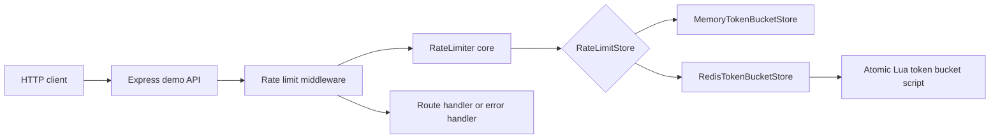

## Project Structure

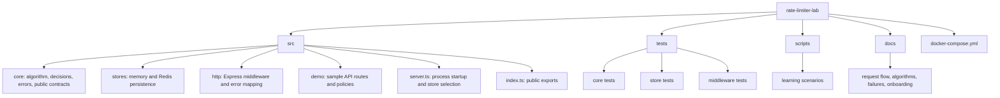

### Important Directories

| Path | Purpose |
| --- | --- |
| `src/core` | Pure rate limiter logic: policies, decisions, token bucket math, stats, and errors. |
| `src/stores` | Storage adapters that implement `RateLimitStore`. Memory is local. Redis is distributed. |
| `src/http` | Express middleware that converts limiter decisions into headers, route continuation, or errors. |
| `src/demo` | A small API with public, auth, profile, health, and debug routes. |
| `scripts` | Executable learning scenarios that print each limiter decision. |
| `tests` | Unit and integration-style tests for algorithm, stores, middleware, and fault tolerance. |
| `docs` | Human documentation and diagrams. |

## Runtime Components

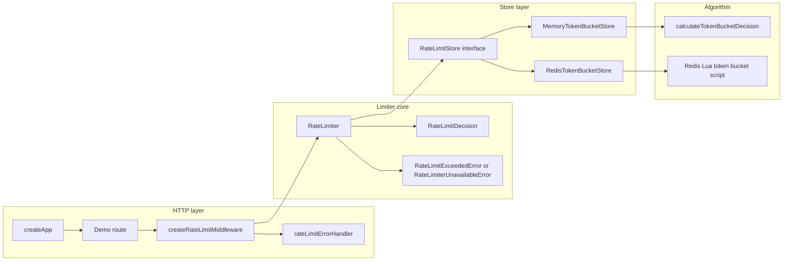

The design keeps HTTP details out of the core limiter. The core only knows about keys, token costs, policies, stores, and decisions. Express is just one integration surface.

## Request Flow

This is the main flow for a request to `GET /api/public`.

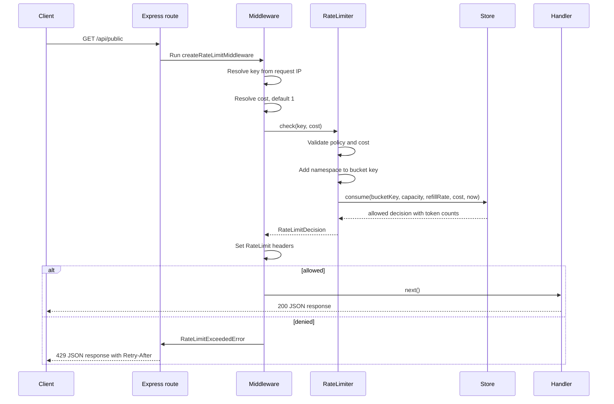

The same flow works for memory and Redis stores. The only difference is where the bucket state lives.

## Token Bucket Flow

The token bucket has two state values:

```text
tokens       Current available tokens
updatedAtMs Last time the bucket was recalculated
```

Each request recalculates the bucket from elapsed time.

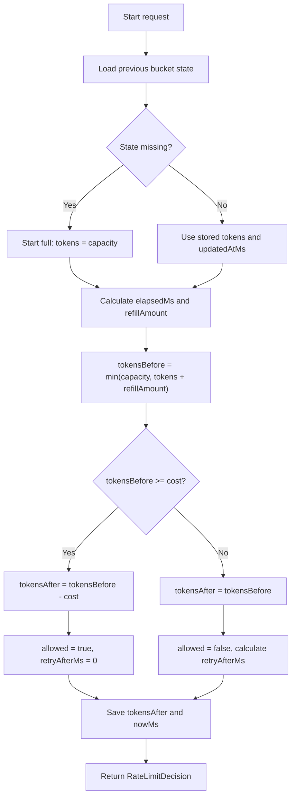

The pure TypeScript implementation is in `src/core/token-bucket.ts`. The memory store calls that function directly. The Redis store implements the same transition inside Lua so multiple app processes can share one atomic bucket.

## Redis Distributed Flow

Redis mode exists for distributed rate limiting. If multiple Node processes receive requests for the same key, they all send consume operations to Redis. Redis executes the Lua script atomically, so two processes cannot consume the same token at the same time.

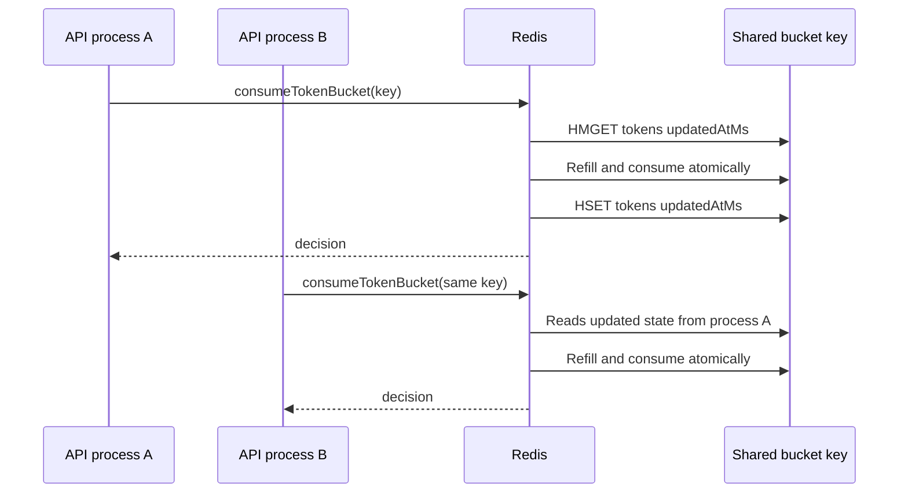

The Redis key has two layers of namespacing:

```text
Redis key prefix      rate-limiter-lab:
Limiter namespace     public-api, auth-api, user-api, etc.
Request key           IP address or user ID
```

Example:

```text
rate-limiter-lab:public-api:::ffff:127.0.0.1
rate-limiter-lab:user-api:user:alice
```

## Middleware Outcomes

The middleware converts a core limiter decision into HTTP behavior.

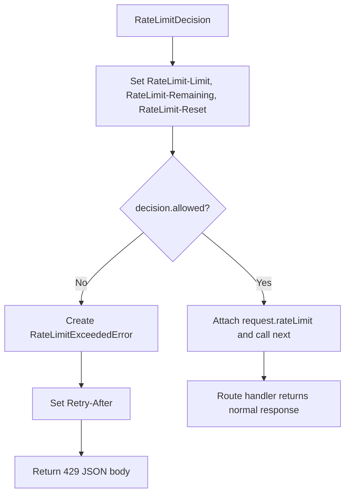

Allowed responses include rate limit headers. Throttled responses include the same rate limit headers plus `Retry-After`.

## Fault Tolerance

The system is designed so rate limiter infrastructure failures do not automatically break the whole API.

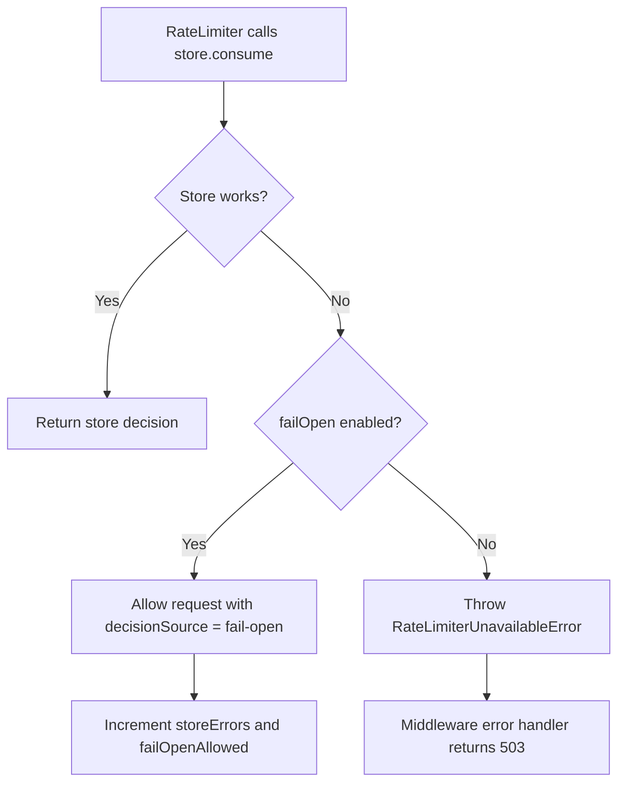

Default routes should usually use fail-open for availability. Sensitive routes, such as login, can use fail-closed. In this demo, `/api/public` and `/api/profile` fail open, while `/api/login` fails closed.

## Demo API Policies

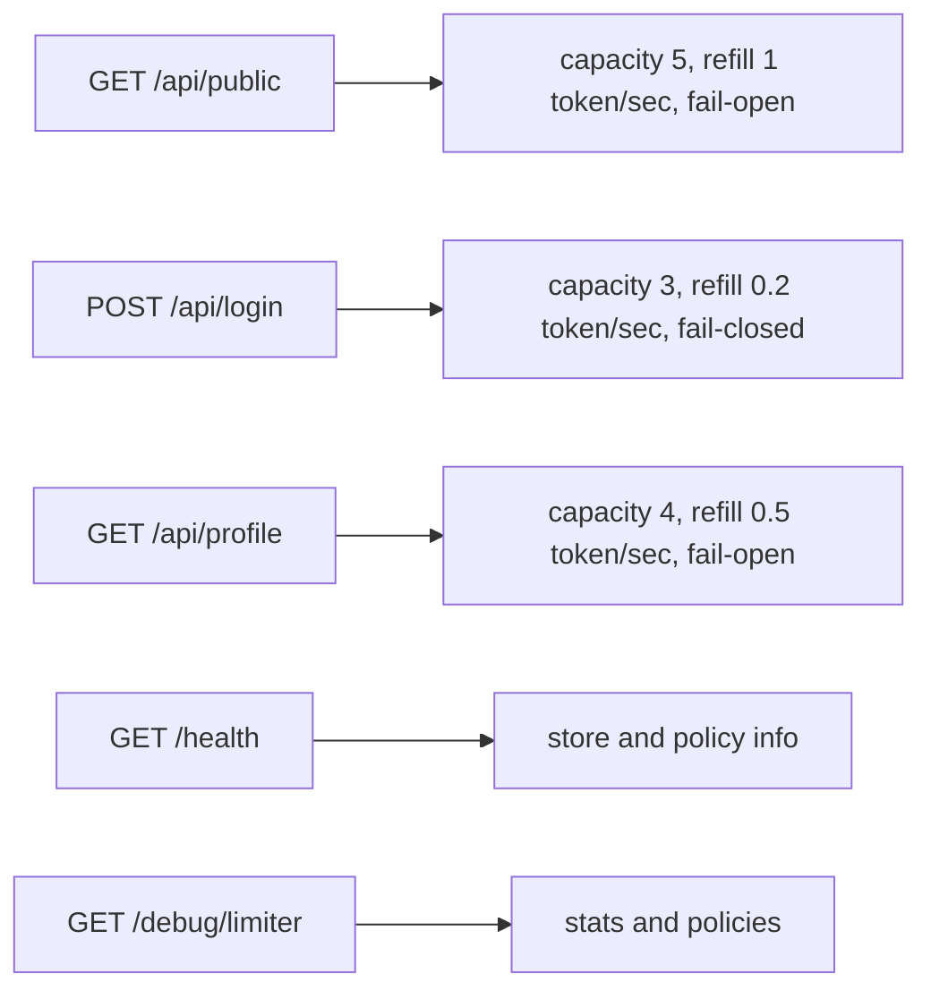

Use these routes to learn different behaviors:

| Route | What it demonstrates |
| --- | --- |
| `GET /api/public` | Normal API limiting by IP. |
| `POST /api/login` | Strict auth-style policy and fail-closed behavior. |
| `GET /api/profile` | Custom key resolution with `x-user-id`. |
| `GET /health` | Startup configuration and active policies. |
| `GET /debug/limiter` | Runtime stats for allowed, denied, store errors, and fail-open decisions. |

## How To Read The Source

Read the files in this order. Each step builds on the previous one.

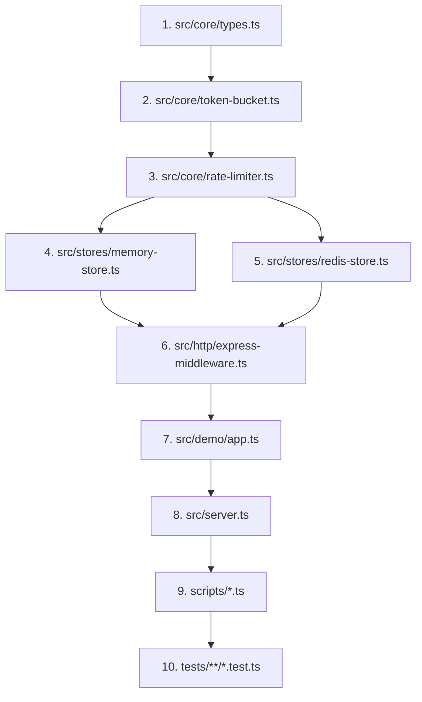

### 1. `src/core/types.ts`

Start here to understand the contracts. The most important interfaces are:

- `RateLimitPolicy`: capacity and refill rate.
- `RateLimitStore`: storage adapter contract.
- `StoreConsumeInput`: the exact data passed to a store.
- `StoreConsumeResult`: the raw allow or deny result from a store.
- `RateLimitDecision`: the enriched decision returned to HTTP code and callers.
- `RateLimiterStats`: counters used by `/debug/limiter`.

### 2. `src/core/token-bucket.ts`

Read `calculateTokenBucketDecision`. This is the pure algorithm:

```text
elapsedMs = nowMs - updatedAtMs
refillAmount = elapsedMs / 1000 * refillRatePerSecond
tokensBefore = min(capacity, previousTokens + refillAmount)
allowed = tokensBefore >= cost
tokensAfter = allowed ? tokensBefore - cost : tokensBefore
```

This file is deterministic and easy to unit test because it does not depend on Express, Redis, or real time.

### 3. `src/core/rate-limiter.ts`

This class is the core orchestrator. Focus on `check`:

1. Validate cost.
2. Resolve current time.
3. Build a namespaced bucket key.
4. Call `store.consume`.
5. Convert the store result into a `RateLimitDecision`.
6. Update stats.
7. If the store fails, choose fail-open or fail-closed behavior.

`assertAllowed` is a convenience wrapper that throws `RateLimitExceededError` when a decision is denied.

### 4. `src/stores/memory-store.ts`

This store keeps buckets in a `Map`. It is best for tests and local learning. It is not distributed.

Important details:

- One map entry per bucket key.
- Calls the pure TypeScript token bucket function.
- Stores `tokens`, `updatedAtMs`, and `lastSeenMs`.
- Periodically cleans idle buckets to limit memory growth.

### 5. `src/stores/redis-store.ts`

This is the production-style distributed store. Read it in two parts:

1. The Lua script string `CONSUME_TOKEN_BUCKET_LUA`.
2. The TypeScript wrapper class `RedisTokenBucketStore`.

The Lua script performs read, refill, consume, write, and TTL update in one atomic Redis command. The wrapper registers the command with `defineCommand`, passes arguments, and parses the result into `StoreConsumeResult`.

### 6. `src/http/express-middleware.ts`

This file adapts the generic limiter to Express.

Key responsibilities:

- Resolve the request key.
- Resolve request cost.
- Call `limiter.check`.
- Attach `request.rateLimit` and `request.rateLimitKey`.
- Write `RateLimit-*` headers.
- Convert denied decisions into `RateLimitExceededError`.
- Convert limiter errors into JSON responses.

### 7. `src/demo/app.ts`

This is where the example routes are assembled. It creates three limiter instances with different policies and mounts them on routes.

Read this file to understand how a real service would configure different limits for different endpoint categories.

### 8. `src/server.ts`

This is process startup:

- Reads environment variables.
- Chooses Redis or memory store.
- Connects to Redis with bounded retry behavior.
- Starts Express.
- Handles shutdown.

If Redis is unavailable at startup, the process still starts. Fail-open routes keep serving traffic.

### 9. `scripts/*.ts`

The scripts are designed for learning by observation:

| Script | Purpose |
| --- | --- |
| `scenario-burst.ts` | Shows a burst exhausting the bucket. |
| `scenario-steady.ts` | Shows refill over time. |
| `scenario-multi-user.ts` | Shows independent buckets for different keys. |
| `scenario-redis-outage.ts` | Shows fail-open vs fail-closed. |
| `scenario-compare-stores.ts` | Compares memory behavior with Redis when Redis is available. |

### 10. `tests/**/*.test.ts`

Use tests as executable documentation:

| Test file | What to learn |
| --- | --- |
| `tests/core/token-bucket.test.ts` | Algorithm boundaries and refill math. |
| `tests/core/rate-limiter.test.ts` | Core orchestration, denied decisions, fail-open, fail-closed. |
| `tests/stores/memory-store.test.ts` | Per-key memory behavior and cleanup. |
| `tests/stores/redis-store.test.ts` | Redis Lua registration, argument shape, parsing, and optional live Redis test. |
| `tests/http/express-middleware.test.ts` | Headers, `429` body, key resolution, and fallback behavior. |

## Source To Runtime Mapping

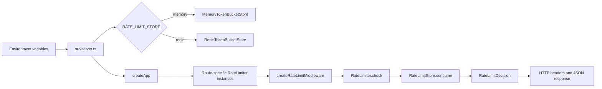

## Key Configuration Values

| Environment variable | Default | Meaning |
| --- | --- | --- |
| `PORT` | `3000` | HTTP server port. |
| `REDIS_URL` | `redis://localhost:6379` | Redis connection URL. |
| `RATE_LIMIT_STORE` | `redis` | Use `redis` or `memory`. |
| `RATE_LIMIT_DEBUG` | `false` | Include debug fields and decision logs. |

## Headers And Error Shapes

Allowed responses include:

```text
RateLimit-Limit: 5
RateLimit-Remaining: 4
RateLimit-Reset: 1777509691
```

Throttled responses return HTTP `429`:

```json
{
  "error": "rate_limit_exceeded",
  "message": "Rate limit exceeded for key \"client-a\". Retry after 1s.",
  "key": "client-a",
  "limit": 5,
  "remaining": 0,
  "retryAfterMs": 1000,
  "resetAt": "2026-04-30T00:41:30.155Z"
}
```

Fail-closed store errors return HTTP `503`:

```json
{
  "error": "rate_limiter_unavailable",
  "message": "store offline"
}
```

## Local Development Workflow

Install dependencies:

```bash
npm install
```

Run in memory mode:

```bash
RATE_LIMIT_STORE=memory RATE_LIMIT_DEBUG=true npm run dev
```

Run in Redis mode:

```bash
npm run redis:up
RATE_LIMIT_STORE=redis RATE_LIMIT_DEBUG=true npm run dev
```

Run tests:

```bash
npm test
```

Run the TypeScript build:

```bash
npm run build
```

Run the optional live Redis test:

```bash
npm run redis:up
RUN_REDIS_TESTS=true npm test
```

Run learning scenarios:

```bash
npm run scenario:burst
npm run scenario:steady
npm run scenario:multi-user
npm run scenario:redis-outage
npm run scenario:compare-stores
```

## First Debugging Exercises

Use these exercises to build intuition.

### Exhaust A Bucket

Run:

```bash
npm run scenario:burst
```

Watch how the first five requests are allowed and later requests are denied. Focus on `tokensBefore`, `tokensAfter`, `remaining`, and `retryAfterMs`.

### Watch Refill Over Time

Run:

```bash
npm run scenario:steady
```

The request spacing allows tokens to refill between checks. This is the easiest scenario for understanding why token bucket is smoother than a fixed window counter.

### Compare Keys

Run:

```bash
npm run scenario:multi-user
```

`user:alice`, `user:bob`, and `user:carol` have separate buckets. This explains why key selection is a product and fairness decision, not only a technical detail.

### Simulate Store Failure

Run:

```bash
npm run scenario:redis-outage
```

The fail-open limiter allows the request and marks `decisionSource = fail-open`. The fail-closed limiter throws `RateLimiterUnavailableError`.

## Common Change Recipes

### Add A New HTTP Route With Rate Limiting

1. Open `src/demo/app.ts`.
2. Create or reuse a `RateLimiter`.
3. Add `createRateLimitMiddleware({ limiter, keyResolver })` before the route handler.
4. Decide whether the route should fail open or fail closed.
5. Add a middleware test if the behavior is new.

### Add A New Store Implementation

1. Implement `RateLimitStore` from `src/core/types.ts`.
2. Ensure `consume` returns `StoreConsumeResult`.
3. Keep read-modify-write atomic if the store is distributed.
4. Add focused store tests.
5. Wire the store in `src/server.ts` only after the adapter is tested.

### Change The Algorithm

1. Start in `src/core/token-bucket.ts`.
2. Update tests in `tests/core/token-bucket.test.ts`.
3. Mirror the same behavior in Redis Lua if Redis mode should stay equivalent.
4. Update `docs/algorithm-comparison.md` and this guide.

## Design Invariants

Keep these rules true as the project changes:

- Core code must not depend on Express.
- HTTP middleware must not know Redis implementation details.
- Store implementations must return the same decision shape.
- Distributed stores must perform bucket updates atomically.
- Fail-open behavior must be explicit and observable in stats.
- Tests should explain behavior, not only chase coverage.
- Documentation should stay close to the code path a developer reads.

## Where To Go Next

After this guide, read these documents:

- [Request flow](request-flow.md)
- [Algorithm comparison](algorithm-comparison.md)
- [Failure modes](failure-modes.md)

Then run each scenario once and inspect the related test file. That sequence gives a complete pass through the system from request, to limiter, to store, to response.
